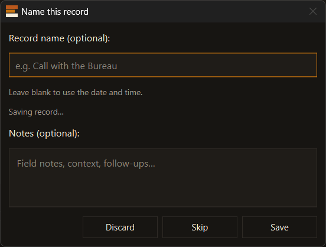
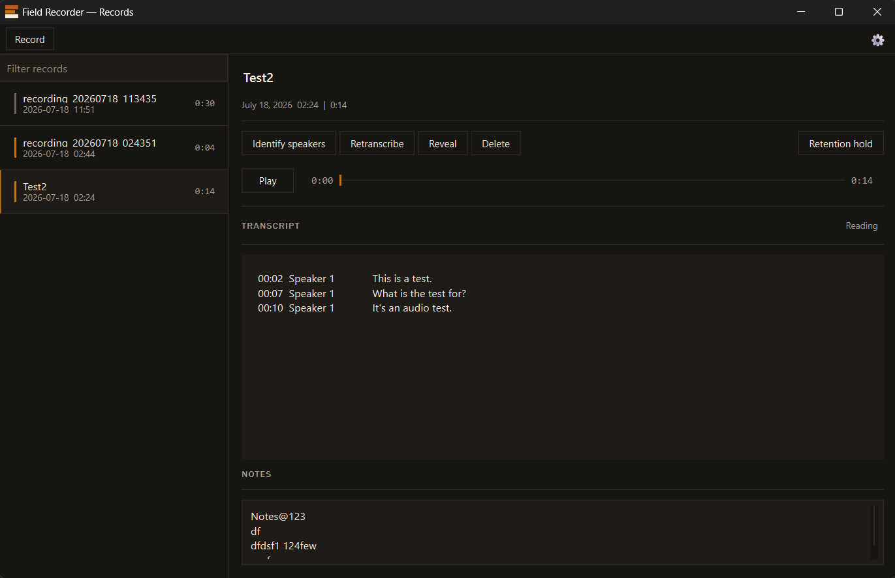
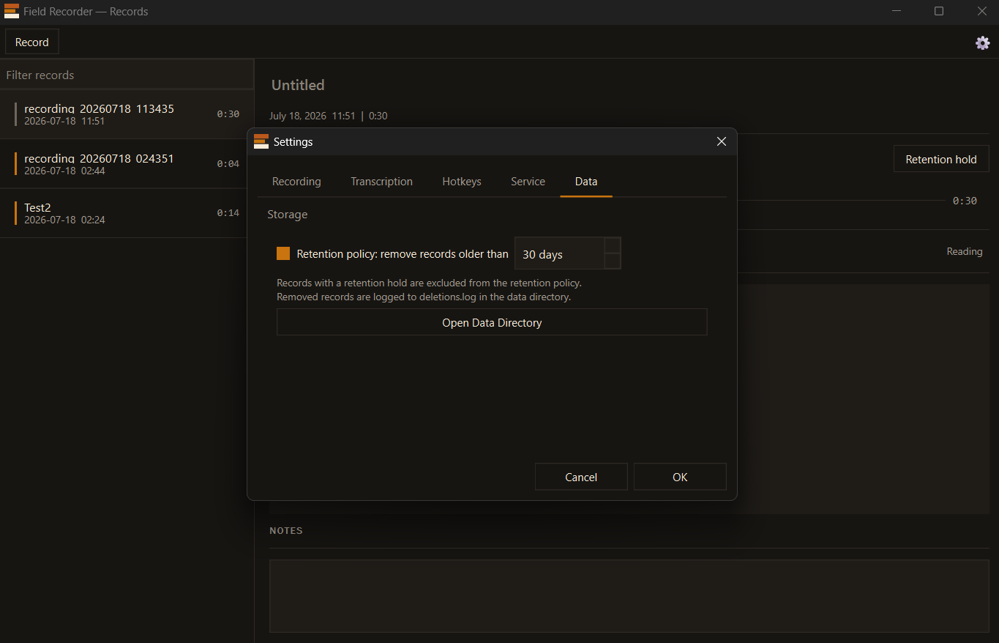

 # Field Recorder - Model 1
 ### An instrument from the Bureau of Applied Science

Captures calls and meetings as structured records.

Windows tray application. On-device transcription by default.

**Download:** [Field Recorder v1.0.0 for Windows](https://github.com/erronjason/bas-field-recorder/releases/download/v1.0.0/FieldRecorder-v1.0.0-windows.zip) — Windows 10/11 (64-bit) only. Extract the ZIP and run `FieldRecorder.exe`; no Python or separate install required. See [Installation](#installation) for details.

---

## Using Field Recorder

Field Recorder lives in your Windows system tray. It captures a call or meeting — your microphone **and** the system audio you hear — mixes them into a single recording, and transcribes it into a searchable record with speaker labels. Audio stays on your machine by default.

### Record a call

1. **Start** — press `Ctrl+Shift+R`, or single-click the tray icon. Capture begins immediately and the tray icon turns orange.
2. **Stop** — press `Ctrl+Shift+R` again (or single-click the tray icon). The naming dialog opens.
3. **Name and save** — give the record a name, add any notes, and click **Save**. Leave the name blank to use the date and time. (Or **Skip** to save it unnamed, **Discard** to throw it away.)

   

That is the whole workflow. The record is transcribed automatically in the background — nothing else is required.

### Read and play a record

Double-click the tray icon to open **Records**.



- **Left** — every record, newest first. Type in **Filter records** to search by name.
- **Right** — the selected record. Press **Play** to listen, read the **Transcript** (toggle **Timestamps** / **Reading**), and edit **Notes** (saved as you type).
- Click a record's name to rename it.
- **Identify speakers** — put real names to `Speaker 1`, `Speaker 2`, …
- **Retranscribe** — run transcription again, e.g. after changing the model or backend.
- **Retention hold** — protect a record from the automatic cleanup policy.
- **Reveal** / **Delete** — show the file on disk / remove the record.

At the top right: the **⚙** gear opens Settings and the **?** button reopens the built-in how-to. While records are transcribing, a **Processing N** count appears there.

### Hotkeys

These work from any application, even while Field Recorder is in the tray:

| Hotkey | Action |
|---|---|
| `Ctrl+Shift+R` | Start / stop capture |
| `Ctrl+Shift+T` | Take notes |
| `Ctrl+Shift+Y` | Pause / resume capture |

Remap any of them in **Settings → Hotkeys**.

### Tray icon

- **Single-click** — start or stop capture
- **Double-click** — open Records
- **Right-click** — full menu (pause, notes, transcription queue, quit)

### Settings

Open Settings with the **⚙** gear in the Records window.



- **Recording** — choose the microphone and the system-audio (loopback) device.
- **Transcription** — on-device (default, private) or off-device (AssemblyAI); model and language.
- **Hotkeys** — remap the shortcuts above.
- **Service** — transcription-engine status and reinstall.
- **Data** — retention policy and a shortcut to the data directory.

> On first launch, Field Recorder downloads and installs its on-device transcription engine (~3–5 GB). See [Installation](#installation) below.

---

## Components

| Component | Description |
|---|---|
| `recorder_gui.py` | Tray application - capture, import, naming, notes, transcription queue |
| `transcription_server.py` | Transcription service - managed by the GUI, also launchable standalone |
| `transcribe.py` | CLI transcription script - direct use without the GUI |
| `bas_records_mcp.py` | MCP server over the records store - search, fetch, import, annotate |

The GUI manages the transcription service as a child process. The service runs in a self-contained embedded Python runtime, installed on first launch.

---

## Data layout

```
%APPDATA%\BureauOfAppliedScience\
├── records\                    # every record produced by any Bureau instrument
├── instruments\
│   └── field-recorder\
│       ├── backend\            # embedded Python runtime and transcription service
│       ├── models\             # Whisper and pyannote weights
│       └── settings.json       # instrument settings
├── tmp\                        # in-progress captures (crash recovery)
├── settings.json               # bureau-level settings
└── deletions.log
```

macOS: `~/Library/Application Support/Bureau of Applied Science/`  
Linux: `~/.local/share/bureau-of-applied-science/`

---

## Installation

**Currently Windows-only** — Windows 10/11 (64-bit). macOS and Linux are not yet supported by the packaged release; on those platforms, run [from source](#building-from-source).

### Release binary

Download the latest release:

- Direct: **[FieldRecorder-v1.0.0-windows.zip](https://github.com/erronjason/bas-field-recorder/releases/download/v1.0.0/FieldRecorder-v1.0.0-windows.zip)** (v1.0.0)
- Or browse every build on the [Releases page](https://github.com/erronjason/bas-field-recorder/releases/latest).

Extract the ZIP and run `FieldRecorder.exe`. No Python or separate install required.

On first launch, the setup wizard installs the on-device transcription engine into a self-contained embedded Python runtime (~10 MB download). The full stack - PyTorch, whisperX, pyannote - is approximately 3–5 GB.

The wizard can be re-run at any time from **Settings → Service → Reinstall transcription service**.

### Building from source

**Requires:** Python 3.10+.

```bash
git clone git@github.com:erronjason/bas-field-recorder.git
cd bas-field-recorder
pip install -r requirements.txt
python recorder_gui.py
```

**Build a distributable:**

```powershell
.\build.ps1
```

Output: `dist\FieldRecorder\FieldRecorder.exe`

---

## Tray icon

The icon uses the BAS three-line mark. All bars change color together to signal capture state:

| State | All bars |
|---|---|
| Idle | Muted — no active capture |
| Capturing | Accent orange — audio being written to disk |
| Paused | Top and bottom bars faint, middle bar accent — capture suspended |
| Saving | Accent-dim — mixdown and transcription queued |

### Menu

| Item | Action |
|---|---|
| Start capture | Begin recording mic and system audio |
| Pause / Resume | Suspend or continue the current capture |
| Stop capture | Stop and open naming dialog |
| Session notes | Floating notes panel (always on top) |
| Pause / Resume transcription queue | Hold or release queued jobs |
| Open records | Opens the Records window |
| Quit | Exits; warns if capture is in progress |

### Default hotkeys

| Hotkey | Action |
|---|---|
| `Ctrl+Shift+R` | Start / Stop capture |
| `Ctrl+Shift+T` | Take notes |
| `Ctrl+Shift+Y` | Pause / Resume capture |

Configurable in **Settings → Hotkeys**.

---

## Transcription

On-device transcription is the default and the instrument's position. Audio does not leave the machine. Off-device is available, clearly labeled, and consented to once.

### On-device

whisperX + pyannote.audio. Requires the first-run installation (~3–5 GB). GPU acceleration via NVIDIA CUDA is used automatically when available.

### Off-device - AssemblyAI

Audio is sent to AssemblyAI's servers over an encrypted connection. Consent is requested once on first use. Set the API key in **Settings → Transcription**.

Off-device is appropriate when no NVIDIA GPU is available, when transcribing a long session on CPU, or when accuracy across five or more speakers is the priority.

**Comparison:**

| | On-device | Off-device |
|---|---|---|
| Cost | Free | ~$0.37–$0.65 / hr of audio (estimate) |
| Privacy | Audio stays on this machine | Audio transmitted to AssemblyAI |
| Speed - GPU | ~10–20× real-time | ~10–15× real-time |
| Speed - CPU | ~0.3–0.5× real-time | ~10–15× real-time |
| 2-speaker accuracy | ~85–95% (estimate) | ~85–90% (estimate) |
| 5+ speaker accuracy | ~70–80% (estimate) | ~85–90% (estimate) |
| Requires | HuggingFace token + model terms | AssemblyAI API key |

---

## CLI

```bash
python transcribe.py <audio_file> [options]
```

| Option | Default | Description |
|---|---|---|
| `--backend` | `local` | `local` - on-device (whisperX + pyannote); `cloud` - off-device (AssemblyAI) |
| `--speakers` | auto | Force a specific speaker count |
| `--model` | `medium` | Whisper model size: `tiny` `base` `small` `medium` `large` |
| `--language` | `en` | Language code; `auto` to detect |
| `--output` | input stem | Output base name - writes `.json` and `.txt` |
| `--hf-token` | `$HF_TOKEN` | HuggingFace token (on-device backend) |
| `--api-key` | `$ASSEMBLYAI_API_KEY` | AssemblyAI API key (off-device backend) |

**HuggingFace token (on-device backend):**

1. Create an account at [huggingface.co](https://huggingface.co).
2. Settings → Access Tokens → New token (read scope).
3. Accept model terms at [pyannote/speaker-diarization-3.1](https://huggingface.co/pyannote/speaker-diarization-3.1).

**Whisper model sizes:**

| Model | VRAM | Notes |
|---|---|---|
| `tiny` | ~1 GB | Lowest accuracy |
| `base` | ~1 GB | |
| `small` | ~2 GB | |
| `medium` | ~5 GB | Default |
| `large` | ~10 GB | Highest accuracy |

Use `--model small` if the GPU runs out of memory on `medium`.

**Supported formats:** `wav` `flac` `m4a` `mp3` `mp4` `ogg` `webm`

---

## MCP server

`bas_records_mcp.py` exposes the records store to MCP-capable clients - search records, read transcripts, import audio, annotate. It serves records produced by any Bureau instrument, not only Field Recorder.

It is a local process speaking over **stdio**. It opens no port and makes no network connection; recordings stay on the machine.

**Register it** with your MCP client. For Claude for Desktop, in `%APPDATA%\Claude\claude_desktop_config.json`:

```json
{
  "mcpServers": {
    "bas-records": {
      "command": "python",
      "args": ["C:\\ABSOLUTE\\PATH\\TO\\bas-field-recorder\\bas_records_mcp.py"]
    }
  }
}
```

Restart the client afterward. Requires `pip install mcp`; the GUI need not be running.

### Tools

| Tool | Purpose |
|---|---|
| `search_records` | Filter by name, transcript text, date range, or speaker. Returns summaries |
| `get_record` | One full record, including transcript segments |
| `get_transcript` | Transcript text - `timestamps` or `reading` |
| `list_participants` | Everyone across the store, with record counts |
| `import_audio` | Copy an audio file into the store as a new record |
| `set_notes` | Replace a record's notes |
| `rename_record` | Set a record's display name |
| `set_retention_hold` | Hold a record against the retention policy, or release it |

Records are also available as resources at `bas://records/{record_id}`.

**There is no delete tool.** Deletion is irreversible; the retention policy and the Records window already provide it under direct operator control. The annotate tools write only operator-owned fields - never transcript segments, `record_id`, or the audio file.

### Prompts

Pre-written entry points for common workflows, for clients that surface MCP prompts (e.g. as slash commands):

| Prompt | Arguments | Does |
|---|---|---|
| `summarize_record` | `record_id` | Key points, decisions, and action items for one record |
| `prep_for_followup` | `speaker` | Open items and last-discussed topics with someone, from their record history |
| `weekly_digest` | `from_date` (optional) | What was recorded in the last 7 days, or since a given date |

A prompt is instructions, not data - each one directs the assistant to call the tools above and report only what they return. None of them are permitted to invent facts about a record.

---

## Record Format

**Revision 1.** Every record produced by BAS - Field Recorder conforms to this schema.

```json
{
  "record_id": "3fa8c1d2-4e7b-4a9c-b1f0-8d2e6c3a5f91",
  "format_revision": 1,
  "display_name": "Call with the Bureau",
  "created_at": "2026-07-16T14:23:00+00:00",
  "audio_file": "recording_20260716_142300.flac",
  "source": {
    "application": "Field Recorder",
    "meeting_title": null,
    "call_direction": null,
    "counterparty": null
  },
  "duration_seconds": 312.4,
  "participants": [],
  "backend": "local",
  "speakers_detected": 2,
  "speaker_names": {
    "SPEAKER_00": "Steve",
    "SPEAKER_01": ""
  },
  "notes": "",
  "retain": false,
  "segments": [
    { "speaker": "SPEAKER_00", "start": 0.83, "end": 2.04, "text": "Good, good." },
    { "speaker": "SPEAKER_01", "start": 2.23, "end": 8.38, "text": "Back from our road trip..." }
  ]
}
```

**Field notes:**

- `record_id` - stable UUID. Not derived from filename or timestamp.
- `format_revision` - increments only on breaking schema changes.
- `source` - best-effort metadata about the capture context. Nulls are honest.
- `speaker_names` - maps diarization labels (`SPEAKER_00`, …) to real identities. Populated by the operator after review.
- `participants` - who was in the session. Distinct from `speaker_names`, which is the label map.
- `retain` - when `true`, the record is excluded from any retention policy.

The plain-text sidecar (`.txt`) is derived from `segments`: `[Speaker N] (Xs – Ys): text`, with diarization labels normalized to `Speaker 1`, `Speaker 2`, etc.

---

## License

Apache License 2.0. See [LICENSE](LICENSE) and [NOTICE](NOTICE).

The source may be used, modified, and redistributed under those terms.
The Bureau of Applied Science name, the BAS mark, and the brand assets in
`recorder/resources/brand/` are excluded — Apache-2.0 §6 does not grant
trademark rights. A derivative work may not present itself as a product of
Bureau of Applied Science.

The transcription engine is installed at runtime and is governed by its own
licenses. See [NOTICE](NOTICE) for the component list.

---

## Accuracy

Speaker labels are detected from audio features. The instrument has no way to know who a speaker is by name; `speaker_names` is populated by the operator.

Short back-channel responses ("yeah", "right", "uh-huh") are the most common source of mis-attribution. Accuracy improves when speakers have distinct voices and uninterrupted turns of reasonable length.
